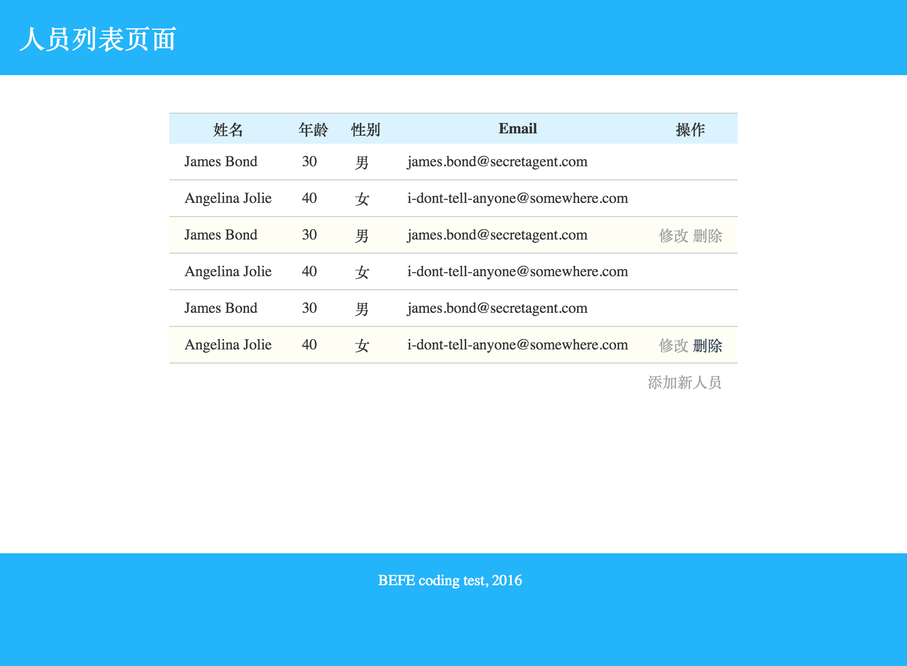
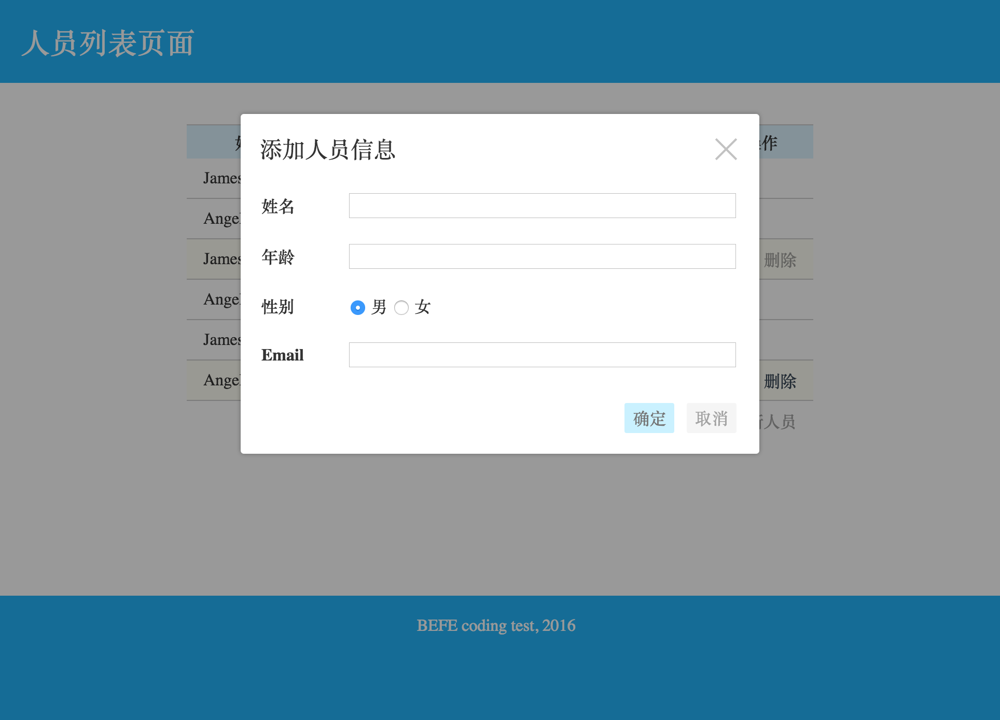
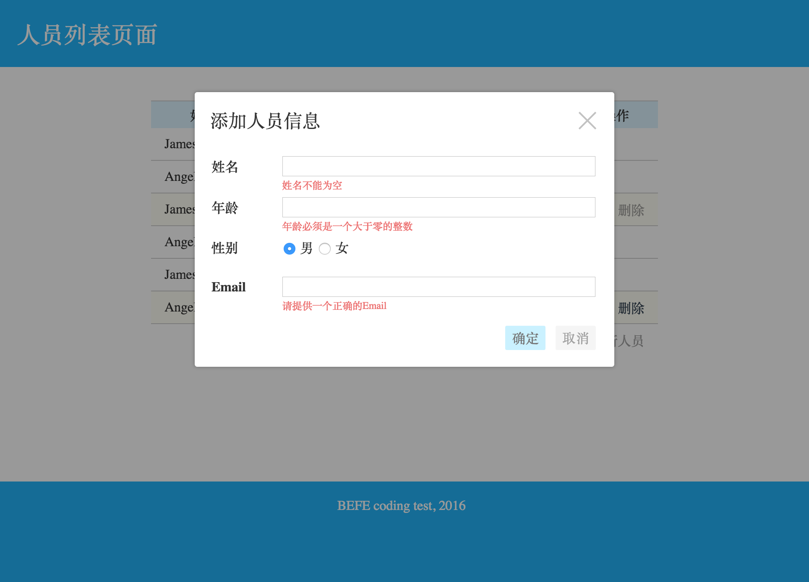
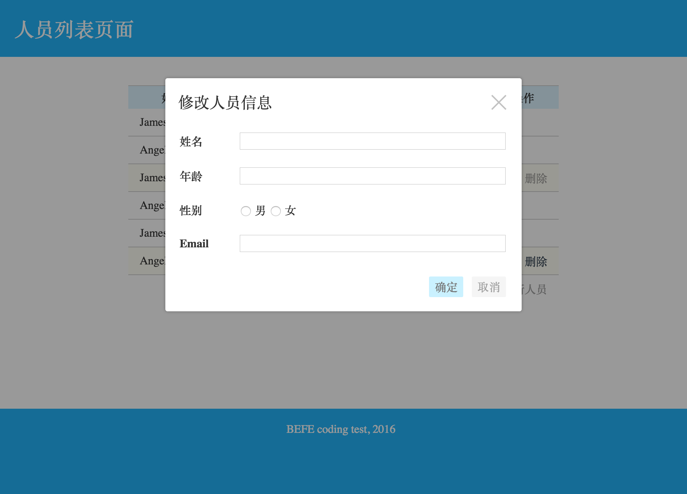
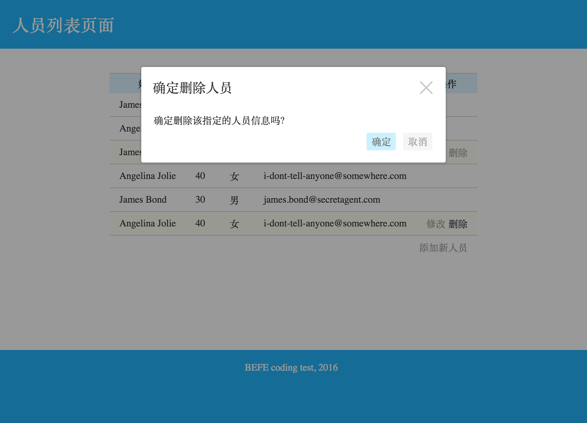

# UI交互文档

你的任务是实现一个简单的人员列表, 并支持增加, 修改, 删除等基本操作

## 展示页面

- 人员记录的操作在未悬浮状态下是不可视的
- 人员记录悬浮时
    - 显示相关的操作: 修改, 删除 (透明度为0.6)
    - 鼠标在操作链接上悬浮时 (透明度为1)
    - 记录变为浅黄色背景    
- 页脚处有添加人员的操作链接

## 添加人员信息

- 点击页脚的添加新人员的链接, 会弹出一个对话框
    - 包括有各个属性的表单
    - 用户点击确定则发送请求给后端创建一个新人员, 更新表格内容, 关闭对话框
    - 如果用户点击取消或右上角的关闭图标, 则会关闭对话框不做任何事情

- 人员信息的各个属性有特定的校验 (本项目为纯前端校验)
    - 姓名 : 非空
    - 年龄 : 大于零的整数
    - 性别 : 不用校验, 但其值为 `m` 与 `f`
    - Email : 符合格式的Email
- 校验失败时, 不会发送请求, 而是显示相应的错误信息, 同时保持对话框可见

## 修改人员信息

- 点击一个相关记录的修改链接, 会弹出一个对话框
    - 基本上跟添加人员的对话框交互过程一致
    - 确认修改之后, 也同样会更新相应的记录的内容
- 表单的校验与添加人员信息的校验一致

## 删除人员信息

- 点击一个相关记录的删除链接, 会弹出一个对话框
    - 对话框显示相关的消息
    - 点击确认则发送删除的请求, 删除该记录, 刷新表格, 关闭对话框
    - 如果用户点击取消或右上角的关闭图标, 则会关闭对话框不做任何事情
